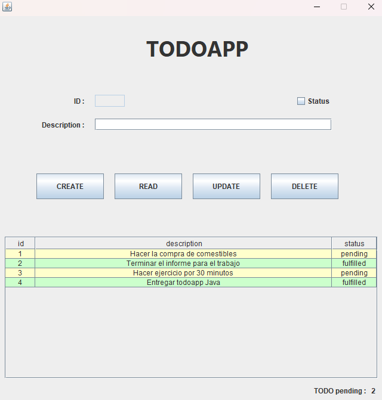

# Creación de una aplicación CRUD

Los estudiantes deben crear una aplicación en Java con siguientes requisitos:

## Requisitos funcionales:

Creación: Se debe poder crear un nuevo registro.
Listar (Read): Se debe poder listar los registros existentes.
Actualizar: Se deben poder actualizar los registros existentes.
Borrar: Se deben poder borrar los registros existentes.

## Requisitos técnicos:

- [x] Si no se ha escrito nada, el usuario no debe poder crear un nuevo registro.
- [x] Se debe crear un aviso cuando se creen, listen, actualicen y eliminen.

## Entregables:

Los estudiantes deben entregar los siguientes elementos:

- El código fuente de la aplicación Java.
- Un documento de texto o Read.me donde expliquen la lógica utilizada para validar los datos y cómo se implementan las diferentes funcionalidades.
- Un informe detallado de cualquier problema que hayan enfrentado durante el desarrollo de la aplicación y cómo los resolvieron.
 

# Solución TODOAPP

Basado en los requisitos y técnicos se crea un aplicación que realiza un CRUD de tareas - TODO. Con Java Swing y MySQL como DB.

## Estructura del proyecto

Se hace uso del patron **DAO**-**Data Access Object**, para contar con un proyecto modularizado y limpio. Además se agrega un archivo de configuración para que los datos sensibles se puedan controlar y no se expongan directamente en las clases que realizan la conexión.

```bash
src
│───main
│    └───java
│         ├───Dao
│         ├───Interfaces
│         ├───models
│         └───ToDoListApp
└───config.properties
```

**Configuración**

El archivo `config.properties` contiene las variables necesarias de configuración de la base de datos, esta configuración es importante para permitir la conexión.

En el package Dao se encuentra la clase `ConfigLoader` que se encarga de abrir el archivo `config.properties` y recopilar las variables necesarias para pasarlas a la clase `MysqlDb` la cual administra la conexión a MySQL, a través de los drivers necesarios.

Este es un ejemplo de archivo, el cual se debe configurar con los valores de su Base de Datos.

```bash
db.username=root
db.password=1234
db.database=todolist
db.port=3306
db.ip=localhost
```



La aplicación inicia en ToDoListApp, la cual tiene una interfaz sencilla pero clara, un formulario que permite editar una descripción de la tarea y un checkbox que permite establecer el estado de una tarea, check es fulfilled o realizada de lo contrario quedará como pending o pendiente. Este formulario nos permite tanto crear como actualizar una tarea existente y previamente seleccionada.

Este formulario está validado, impidiendo la creación de tareas sin haber agregado una descripción.

La vista además cuenta con 4 botones de tipo CRUD en orden, permitiendonos trabajar con nuestra base de datos.

Por ultimo la lista de tareas es mostrada y renderizada en una tabla con estilos personalizados segun el status o estado de la TODO. También se agrega una funcionalidad de un contador de tareas pendientes al pie de la tabla, para ello se hace uso de streams.

## SQL

En el proyecto se encuentra las sentencias - query [sql](./todolist.sql) utilizadas para crear la tabla, insertar sus primeros valores y listarlos. 

```bash
 _______________________
|  ToDo                 |
|-----------------------|
| - id: int             |
| - description: String |
| - status: boolean     |
|_______________________|
```

El proyecto tiene un solo modelo que es la entidad ToDo, y cuenta con una interface DAO y su implementación en package interfaces. Esta implementación del modelo utiliza Dao.MysqlDB para realizar las operaciones necesarias con la base de datos.

## Problemas solucionados

Principalmente el tiempo, por lo cual se priorizó cumplir con los requisitos necesarios y un diseño sencillo pero preciso. También puedo mencionar que necesite investigar como utilizar variables y datos sensibles de la mejor manera, lo cual terminó por la creación de un archivo config.properties para poder configurar la base de datos sin tener que manipular directamente el código, haciendolo menos propenso a que se cometa un error al tratar de configurarlo.